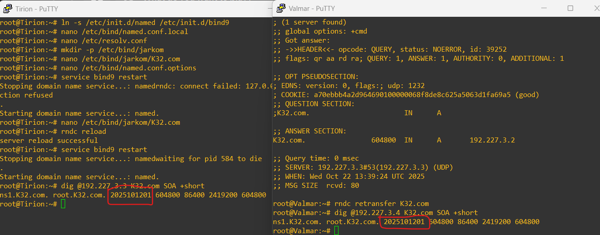

# Laporan Resmi Praktikum Modul 2 Jarkom

|No|Nama anggota|NRP|
|---|---|---|
|1. | Tasya Aulia Darmawan | 5027241009|
|2. | Ahmad Rafi F D | 5027241068|

## Soal 1-3
Eonwe merentangkan tiga jalur:

- **Barat** → Earendil & Elwing  
- **Timur** → Círdan, Elrond, Maglor  
- **DMZ / Pelabuhan** → Sirion, Tirion, Valmar, Lindon, Vingilot  

Konfigurasi IP, gateway, dan DNS disesuaikan dengan glosarium yang diberikan.
---

## Soal 1
Tetapkan alamat dan default gateway tiap tokoh sesuai glosarium yang sudah diberikan.

---

### 1. Eonwe (Router / NAT)

```bash
auto eth0
iface eth0 inet dhcp

auto eth1
iface eth1 inet static
    address 192.227.1.1
    netmask 255.255.255.0

auto eth2
iface eth2 inet static
    address 192.227.2.1
    netmask 255.255.255.0

auto eth3
iface eth3 inet static
    address 192.227.3.1
    netmask 255.255.255.0

up iptables -t nat -A POSTROUTING -o eth0 -j MASQUERADE -s 192.227.0.0/16

echo nameserver 192.168.122.1 > /etc/resolv.conf

apt update
apt install -y iptables
```

### /etc/resolv.conf
```
nameserver 192.168.122.1
```

### /root/.bashrc
```
# ======== TOOLS INSTALLER ========
apt update
apt install -y iptables

# ======== DNS Resolver ========
echo nameserver 192.168.122.1 > /etc/resolv.conf

# ======== NAT Masquerading ========
iptables -t nat -A POSTROUTING -o eth0 -j MASQUERADE -s 192.227.0.0/16
```

### 2. Client Barat (Earendil & Elwing)
```
# Earendil
auto eth0
iface eth0 inet static
    address 192.227.1.2
    netmask 255.255.255.0
    gateway 192.227.1.1

# Elwing
auto eth0
iface eth0 inet static
    address 192.227.1.3
    netmask 255.255.255.0
    gateway 192.227.1.1

echo nameserver 192.168.122.1 > /etc/resolv.conf
```

### /root/.bashrc
```
echo nameserver 192.168.122.1 > /etc/resolv.conf  # DNS Resolver
```

### 3. Client Timur
```
auto eth0
iface eth0 inet static
    address 192.227.2.2
    netmask 255.255.255.0
    gateway 192.227.2.1

auto eth0
iface eth0 inet static
    address 192.227.2.3
    netmask 255.255.255.0
    gateway 192.227.2.1

auto eth0
iface eth0 inet static
    address 192.227.2.4
    netmask 255.255.255.0
    gateway 192.227.2.1
```
### /root/.bashrc
```
echo nameserver 192.168.122.1 > /etc/resolv.conf  # DNS Resolver
```

### 4. Zona DMZ (Pelabuhan & Server)
#### a) Sirion (Reverse Proxy)
```
auto eth0
iface eth0 inet static
    address 192.227.3.2
    netmask 255.255.255.0
    gateway 192.227.3.1
```
#### b) Tirion (DNS Utama)
```
auto eth0
iface eth0 inet static
    address 192.227.3.3
    netmask 255.255.255.0
    gateway 192.227.3.1
```
#### c) Valmar (DNS Bayangan)
```
auto eth0
iface eth0 inet static
    address 192.227.3.4
    netmask 255.255.255.0
    gateway 192.227.3.1
```
#### d) Lindon (Web Statis)
```
auto eth0
iface eth0 inet static
    address 192.227.3.5
    netmask 255.255.255.0
    gateway 192.227.3.1
```
#### e) Vingilot (Web Dinaris)
```
auto eth0
iface eth0 inet static
    address 192.227.3.6
    netmask 255.255.255.0
    gateway 192.227.3.1
```
### /root/.bashrc
```
echo nameserver 192.168.122.1 > /etc/resolv.conf  # DNS Resolver
```

## Soal 4
Membangun sistem DNS authoritative di Tirion (ns1) sebagai master dan Valmar (ns2) sebagai slave untuk domain K32.com, lengkap dengan konfigurasi zona, transfer antar-server, dan pengaturan resolver agar seluruh host menggunakan ns1 dan ns2 sebagai DNS utama.

---
### 1. Tirion (ns1 / Master)
```
apt update
apt install -y bind9
ln -s /etc/init.d/named /etc/init.d/bind9
```
Konfigurasi zona K32.com sebagai master
```
nano /etc/bind/named.conf.local
```
Isi File:
```
zone "K32.com" {
    type master;
    file "/etc/bind/jarkom/K32.com";
    allow-transfer { 192.227.3.4; };  // IP Valmar (ns2)
    notify yes;
};
```
Konfigurasi resolver
```
nano /etc/resolv.conf
```
Isi File:
```
search K32.com
nameserver 192.227.3.3   # ns1 (Tirion)
nameserver 192.227.3.4   # ns2 (Valmar)
nameserver 192.168.122.1
```
Direktori zona dan isi file zona
```
mkdir -p /etc/bind/jarkom
nano /etc/bind/jarkom/K32.com
```
Isi file zona:
```
$TTL    604800
@       IN      SOA     ns1.K32.com. root.K32.com. (
                        2025101201 ; Serial
                        604800     ; Refresh
                        86400      ; Retry
                        2419200    ; Expire
                        604800 )   ; Negative Cache TTL

; Nameserver
@       IN      NS      ns1.K32.com.
@       IN      NS      ns2.K32.com.

; A Record
ns1     IN      A       192.227.3.3
ns2     IN      A       192.227.3.4
@       IN      A       192.227.3.2   ; Sirion
www     IN      A       192.227.3.2   ; Sirion
```
Konfigurasi forwarder agar DNS bisa resolve ke luar
```
nano /etc/bind/named.conf.options
```
Isi file:
```
options {
    directory "/var/cache/bind";

    forwarders {
        192.168.122.1;
    };

    allow-query { any; };
    dnssec-validation auto;
    listen-on-v6 { any; };
};
```
---
Restart & Cek Status
```
service bind9 restart
service bind9 status
```
### 2. Valmar (ns2 / Slave)
```
apt update
apt install -y bind9
ln -s /etc/init.d/named /etc/init.d/bind9

nano /etc/bind/named.conf.local
```
Isi file:
```
zone "K32.com" {
    type slave;
    primaries { 192.227.3.3; };     # Master = Tirion
    file "/var/lib/bind/K32.com";   # Zona disimpan otomatis
};
```
Konfigurasi Resolver:
```
nano /etc/resolv.conf
```
Isi file:
```
search K32.com
nameserver 192.227.3.3   # ns1 (Tirion)
nameserver 192.227.3.4   # ns2 (Valmar)
nameserver 192.168.122.1
```
---
Restart & Cek Status
```
service bind9 restart
service bind9 status
```
Verifikasi Authoritative DNS
```
# Tes query dari client mana pun (misal Earendil)
dig @192.227.3.3 K32.com      # Jawaban dari ns1 (master)
dig @192.227.3.4 K32.com      # Jawaban dari ns2 (slave)
```

---

## Soal 5
Memberi hostname pada seluruh node sesuai glosarium dan menambahkan A record tiap host dalam zona K32.com agar semua perangkat dapat saling mengenali menggunakan nama domain masing-masing secara system-wide, kecuali untuk node ns1 dan ns2.

---
### 1. Konfigurasi di Tirion (ns1/master)
Edit file zona K32.com:
```
nano /etc/bind/jarkom/K32.com
```
Tambahkan konfigurasi berikut:
```
; Barat
earendil   IN  A  192.227.1.2
elwing     IN  A  192.227.1.3

; Timur
cirdan     IN  A  192.227.2.2
elrond     IN  A  192.227.2.3
maglor     IN  A  192.227.2.4
verda      IN  A  192.227.2.5

; DMZ
sirion     IN  A  192.227.3.2
tirion     IN  A  192.227.3.3
valmar     IN  A  192.227.3.4
lindon     IN  A  192.227.3.5
vingilot   IN  A  192.227.3.6
```
---
Reload & Restart Service BIND
```
rndc reload
service bind9 restart
```
### 2. Konfigurasi di Valmar (ns2/slave)
Periksa apakah zona sudah tersinkron
```
ls /var/lib/bind/
```
Jika belum ada file K32.com, jalankan
```
rndc retransfer K32.com
```
Lakukan ping ke setiap host untuk memastikan DNS resolve berjalan:
```
ping earendil.K32.com
ping elwing.K32.com
ping cirdan.K32.com
ping elrond.K32.com
ping maglor.K32.com
ping sirion.K32.com
ping tirion.K32.com
ping valmar.K32.com
ping lindon.K32.com
ping vingilot.K32.com
```
Update resolver di setiap node
```
nano /etc/resolv.conf
```
Isi dengan:
```
search K32.com
nameserver 192.227.3.3   # ns1 (Tirion)
nameserver 192.227.3.4   # ns2 (Valmar)
nameserver 192.168.122.1
```

---
## Soal 6
Memastikan zona K32.com tersinkron antara Tirion (ns1/master) dan Valmar (ns2/slave) dengan melakukan pengecekan nilai serial SOA. Jika berbeda, lakukan zone retransfer agar Valmar memperoleh salinan zona terbaru dari Tirion.

---
### 1. Periksa Serial SOA di Tirion (ns1/master)
Gunakan command berikut untuk menampilkan nilai serial dari zona K32.com:
```
dig @192.227.3.3 K32.com SOA
```
### 2. Periksa Serial SOA di Valmar (ns2/slave)
Gunakan perintah serupa di Valmar:
```
dig @192.227.3.4 K32.com SOA
```
### 3. Jika Nilai Serial Berbeda
Lakukan retransfer zona dari Tirion ke Valmar agar data DNS tetap sinkron:
```
rndc retransfer K32.com
service bind9 restart
```
### 4. Verifikasi Kembali
Setelah retransfer, pastikan nilai serial SOA sudah sama antara Tirion dan Valmar:
```
dig @192.227.3.4 K32.com SOA
```

---
## Soal 7
Menambahkan record DNS untuk server web di zona K32.com, yaitu Sirion (gateway utama), Lindon (web statis), dan Vingilot (web dinamis). Kemudian menetapkan CNAME agar www.K32.com, static.K32.com, dan app.K32.com mengarah ke masing-masing host terkait, serta memverifikasi bahwa seluruh hostname dapat di-resolve dengan benar dari dua klien berbeda.

---
### 1. Tambahkan A Record dan CNAME di Tirion (ns1/master)
```
nano /etc/bind/jarkom/K32.com
```
Tambahkan konfigurasi berikut:
```
; DMZ / Web related records
sirion      IN  A       192.227.3.2
lindon      IN  A       192.227.3.5
vingilot    IN  A       192.227.3.6

www         IN  CNAME   sirion.K32.com.
static      IN  CNAME   lindon.K32.com.
app         IN  CNAME   vingilot.K32.com.
```
---
Reload Service
```
service bind9 restart
dig @192.227.3.4 K32.com SOA
```
### 2. Sinkronisasi Zona di Valmar (ns2/slave)
Lakukan retransfer zona agar Valmar mendapat update terbaru:
```
rndc retransfer K32.com
dig @192.227.3.4 K32.com SOA
```
*Pastikan serial SOA antara Tirion dan Valmar sama.
### 3. Verifikasi dari Klien (misalnya Earendil dan Elwing)
Gunakan perintah berikut untuk memastikan semua hostname resolve dengan benar:
```
dig sirion.K32.com
dig www.K32.com
dig lindon.K32.com
dig static.K32.com
dig vingilot.K32.com
dig app.K32.com
```
---
### Hasil yang diharapkan
```
sirion.K32.com.   IN A      192.227.3.2
www.K32.com.      IN CNAME  sirion.K32.com.
                  IN A      192.227.3.2

lindon.K32.com.   IN A      192.227.3.5
static.K32.com.   IN CNAME  lindon.K32.com.
                  IN A      192.227.3.5

vingilot.K32.com. IN A      192.227.3.6
app.K32.com.      IN CNAME  vingilot.K32.com.
                  IN A      192.227.3.6
```

---
## Soal 8
Buat reverse zone di Tirion (ns1) untuk segmen DMZ tempat Sirion, Lindon, dan Vingilot, lalu konfigurasikan Valmar (ns2) sebagai slave zone-nya. Tambahkan PTR agar pencarian balik IP mengembalikan hostname yang benar dan pastikan hasil query bersifat authoritative.

---
### 1. Di Tirion (ns1)
a) Buka file konfigurasi zona:
```
nano /etc/bind/named.conf.local
```
b) Tambahkan deklarasi reverse zone:
```
zone "3.227.192.in-addr.arpa" {
    type master;
    file "/etc/bind/jarkom/3.227.192.in-addr.arpa";
    allow-transfer { 192.227.3.4; };   // Valmar (ns2)
    notify yes;
};
```
c) Buat file zona reverse:
```
nano /etc/bind/jarkom/3.227.192.in-addr.arpa
```
d) Isi dengan:
```
$TTL    604800
@       IN      SOA     ns1.K32.com. root.K32.com. (
                        2025101301  ; Serial
                        604800      ; Refresh
                        86400       ; Retry
                        2419200     ; Expire
                        604800 )    ; Negative Cache TTL

; NS Records
@       IN      NS      ns1.K32.com.
@       IN      NS      ns2.K32.com.

; PTR Records
2       IN      PTR     sirion.K32.com.
5       IN      PTR     lindon.K32.com.
6       IN      PTR     vingilot.K32.com.
```
---
e) Periksa & Reload
```
named-checkzone 3.227.192.in-addr.arpa /etc/bind/jarkom/3.227.192.in-addr.arpa
rndc reload
```
### 2. Di Valmar (ns2)
a) Deklarasikan reverse zone sebagai slave
```
nano /etc/bind/named.conf.local
```
b) Tambahkan
```
zone "3.227.192.in-addr.arpa" {
    type slave;
    primaries { 192.227.3.3; };   // Master = Tirion
    file "/var/lib/bind/3.227.192.in-addr.arpa";
};
```
---
c) Restart service & Cek file zona:
```
service bind9 restart
ls -l /var/lib/bind/3.227.192.in-addr.arpa
```
---
Verifikasi di Earendil
```
dig -x 192.227.3.2
dig -x 192.227.3.5
dig -x 192.227.3.6
```
Expected output:
```
;; ANSWER SECTION:
2.3.227.192.in-addr.arpa. 604800 IN PTR sirion.K32.com.
5.3.227.192.in-addr.arpa. 604800 IN PTR lindon.K32.com.
6.3.227.192.in-addr.arpa. 604800 IN PTR vingilot.K32.com.

dan terdapat flag
;; flags: qr aa rd ra;
```


Pastikan sinkronisasi Master & Slave
 Di Tirion
``` dig @192.227.3.3 3.227.192.in-addr.arpa SOA +short ```

Di Valmar
``` dig @192.227.3.4 3.227.192.in-addr.arpa SOA ```

Pastikan nilai serialnya sama

## Soal 9
Menjalankan web server statis di Lindon (static.<xxxx>.com) dengan fitur autoindex pada folder /annals/, lalu memastikan situs hanya bisa diakses menggunakan hostname, bukan IP address.

---

1. Di Lindon (server web)
a) Update & Install Apache
```
apt update
apt install -y apache2
```
b) Pastikan Apache Berjalan
```
service apache2 start
service apache2 status
```
c) Siapkan folder dan contoh file
```
mkdir -p /var/www/static/annals
echo "aku suka suki" > /var/www/static/index.html
echo "ADMINNNNNN aku mawu cindo fineshyt" > /var/www/static/annals/catatan1.txt
echo "Catatan Om Martin bersyukur kepada nasi dingin dengan teri dan kangkung pedas serta para sunda/tomboy fineshyt" > /var/www/static/annals/catatan2.txt
```
d) 
```
nano /etc/apache2/sites-available/static.K32.com.conf
```
e) Buat virtual host untuk static.K32.com (file /etc/apache2/sites-available/static.K32.com.conf)
```
<VirtualHost *:80>
    ServerAdmin webmaster@K32.com
    ServerName static.K32.com
    ServerAlias static.K32.com

    DocumentRoot /var/www/static

    <Directory /var/www/static>
        Options Indexes FollowSymLinks
        AllowOverride None
        Require all granted
    </Directory>

    ErrorLog ${APACHE_LOG_DIR}/static_error.log
    CustomLog ${APACHE_LOG_DIR}/static_access.log combined
</VirtualHost>
```
f) Reload
```
service apache2 reload
```
g) Enable site dan restart Apache
```
a2ensite static.K32.com.conf
service apache2 reload
service apache2 restart
service apache2 status
```
---
For Checking, in Earendil, do:
```
curl http://static.K32.com/index.html
```

```
curl http://static.K32.com/annals/catatan1.txt
```

```
curl http://static.K32.com/annals/catatan2.txt
```


## Soal 10
Menjalankan web dinamis (PHP-FPM) di server Vingilot dengan hostname app.<xxxx>.com.
Buat dua halaman, yaitu beranda (index.php) dan about.php, lalu terapkan rewrite rule agar halaman /about bisa diakses tanpa menuliskan .php di URL.
Akses harus dilakukan melalui hostname, bukan IP address.

---

1. Instal dan aktifkan modul yang dibutuhkan
```
apt update
apt install -y apache2 libapache2-mod-fcgid php php-fpm
a2enmod proxy_fcgi setenvif
a2enconf php*-fpm
a2enmod rewrite
php-fpm8.4 -D
ls -l /run/php/
service apache2 start
service apache2 reload
service apache2 restart
service apache2 status
```
2. Buat file web dinamis
```
mkdir -p /var/www/app
nano /var/www/app/index.php
```
Diisi:
```
<?php
echo "<h1>mas fuad pengen jadi femboy terus cosplay <strong>hiura mihate</strong></h1>";
echo "<p>Saya lagi membayangkan prabowo mendaki semeru, trus pas nyampe di puncak, dia mengibarkan bendera merah putih lalu dia berteriak, titiekkkkk kembalilah ke pelukanku</p>";
?>
```
Lanjut:
```
nano /var/www/app/about.php
```
Diisi:
```
<?php
echo "<h1>samsul arip, when yh extend.</h1>";
echo "<p>[Verse 1]Bapak Mulyono raja tipu-tipuMobil ESEMKA hanyalah salah satuBanyak fakta banyak bukti ditemuiMulyono serakahnya setengah mati</p>";
?>
```
3. Cek Syntax PHP:
```
php -l /var/www/app/index.php
```
4. Konfigurasi Virtual Host www.K32.com
```
nano /etc/apache2/sites-available/app.K32.com.conf
```
Isi dengan:
```
<VirtualHost *:80>
    ServerAdmin webmaster@K32.com
    ServerName app.K32.com
    ServerAlias app.K32.com

    DocumentRoot /var/www/app

    <Directory /var/www/app>
        Options Indexes FollowSymLinks
        AllowOverride All
        Require all granted
    </Directory>

    ErrorLog ${APACHE_LOG_DIR}/app_error.log
    CustomLog ${APACHE_LOG_DIR}/app_access.log combined
</VirtualHost>
```
5. Aktifkan Konfigurasi:
```
a2ensite app.K32.com.conf
a2dissite 000-default.conf
service apache2 reload
service apache2 restart
apache2ctl configtest
```
6. Tambahkan .htaccess
```
nano /var/www/app/.htaccess
```
Isi dengan:
```
RewriteEngine On
RewriteCond %{REQUEST_FILENAME} !-f
RewriteRule ^about$ about.php [L]
```
---
Verifikasi di Earendil
```
ping app.K32.com
curl http://app.K32.com/
curl http://app.K32.com/about
```


## Soal 11
Menjadikan Sirion sebagai reverse proxy dengan path-based routing sehingga /static diteruskan ke Lindon dan /app diteruskan ke Vingilot, sambil meneruskan header Host dan X-Real-IP, serta menerima www.K32.com (kanonik) dan sirion.K32.com.

---

1. Di Sirion
a) Update & install Apache
```
apt update
apt install -y apache2
service apache2 start
```
b) Aktifkan modul yang diperlukan
```
a2enmod proxy
a2enmod proxy_http
a2enmod headers
a2enmod rewrite

service apache2 reload
service apache2 restart
```
3. Buat virtual host
```
nano /etc/apache2/sites-available/sirion.K32.com.conf
```
Isi dengan:
```
<VirtualHost *:80>
    ServerAdmin webmaster@K32.com
    ServerName www.K32.com
    ServerAlias sirion.K32.com

    # Reverse Proxy untuk /static ke Lindon
    ProxyPass        /static http://192.227.3.5/
    ProxyPassReverse /static http://192.227.3.5/

    # Reverse Proxy untuk /app ke Vingilot
    ProxyPass        /app http://192.227.3.6/
    ProxyPassReverse /app http://192.227.3.6/

    # Forward header Host dan X-Real-IP ke backend
    RequestHeader set Host "%{HTTP_HOST}s"
    RequestHeader set X-Real-IP "%{REMOTE_ADDR}s"

    ErrorLog ${APACHE_LOG_DIR}/sirion_error.log
    CustomLog ${APACHE_LOG_DIR}/sirion_access.log combined
</VirtualHost>
```
4. Aktifkan Site & Restart
```
a2ensite sirion.K32.com.conf
a2dissite 000-default.conf   # opsional
service apache2 reload
service apache2 restart

apache2ctl configtest   # harus menampilkan "Syntax OK"
```
5. Verifikasi dari client Earendil
Pastikan DNS/hosts resolve www.K32.com ke Sirion (192.227.3.2), lalu jalankan:
```
# cek konektivitas
ping www.K32.com
ping sirion.K32.com

# cek konten static (dari Lindon lewat Sirion)
curl http://www.K32.com/static/
curl http://www.K32.com/static/annals/catatan1.txt
curl http://www.K32.com/static/annals/catatan2.txt

# cek konten app (dari Vingilot lewat Sirion)
curl http://www.K32.com/app/
curl http://www.K32.com/app/about
```


## Soal 12
Melindungi direktori /admin di Sirion menggunakan Basic Authentication, sehingga akses tanpa kredensial ditolak (401 Unauthorized) dan hanya pengguna dengan username–password yang benar yang dapat masuk.

---
1. Di Sirion
a) Buat folder dan file rahasia
```
mkdir -p /var/www/sirion/admin
echo "inih akun rahasyia admin :p" > /var/www/sirion/admin/index.html
```
b) Install apache2-utils untuk htpasswd
```
apt update
apt install -y apache2-utils
```
c) Buat user dan password
```
htpasswd -c /etc/apache2/.htpasswd admin
```
d) Edit konfigurasi virtual host
```
nano /etc/apache2/sites-available/sirion.K32.com.conf
```
e) Isi file:
```
<VirtualHost *:80>
    ServerAdmin webmaster@K32.com
    ServerName www.K32.com
    ServerAlias sirion.K32.com

    DocumentRoot /var/www/sirion

    <Directory /var/www/sirion>
        Options Indexes FollowSymLinks
        AllowOverride All
        Require all granted
    </Directory>

    # Proteksi Basic Auth untuk path /admin
    <Location "/admin">
        AuthType Basic
        AuthName "Restricted Area"
        AuthUserFile /etc/apache2/.htpasswd
        Require valid-user
    </Location>

    # Reverse Proxy rules
    ProxyPass        /static http://192.227.3.5/
    ProxyPassReverse /static http://192.227.3.5/

    ProxyPass        /app http://192.227.3.6/
    ProxyPassReverse /app http://192.227.3.6/

    # Forward headers ke backend
    RequestHeader set Host "%{HTTP_HOST}s"
    RequestHeader set X-Real-IP "%{REMOTE_ADDR}s"

    ErrorLog ${APACHE_LOG_DIR}/sirion_error.log
    CustomLog ${APACHE_LOG_DIR}/sirion_access.log combined
</VirtualHost>
```
f) Aktifkan site & restart
```
a2ensite sirion.K32.com.conf
service apache2 reload
service apache2 restart

apache2ctl configtest   # harus muncul: Syntax OK
```
5. Di Earendil For Testing
```
# Akses tanpa kredensial (harus ditolak)
curl -i http://www.K32.com/admin/

# Akses dengan kredensial benar (harus berhasil)
curl -i -u admin:rahasia http://www.K32.com/admin/
```


## Soal 13
Konfigurasi agar semua akses menuju IP Sirion atau sirion.K32.com secara otomatis diarahkan (redirect 301) ke www.K32.com sebagai hostname utama (canonical host).

---
1. Di Tirion (DNS Server)
a) Tambahkan zona K32.com di file konfigurasi BIND
```
nano /etc/bind/named.conf.local
```
Tambahkan
```
zone "K32.com" {
    type master;
    file "/etc/bind/zones/db.K32.com";
};
```
b) Buat direktori zona dan isi record:
```
mkdir -p /etc/bind/zones
nano /etc/bind/zones/db.K32.com
```
Isi dengan:
```
$TTL 1h
@   IN SOA  ns1.k32.com. admin.K32.com. (
        2025101301 ; serial
        1h
        15m
        1w
        1h )

IN NS ns1.K32.com.
IN NS ns2.K32.com.

ns1     IN A 192.227.3.3
ns2     IN A 192.227.3.4

@       IN A 192.227.3.2
www     IN A 192.227.3.2
sirion  IN A 192.227.3.2
```
c) Cek & Restart
```
named-checkzone K32.com /etc/bind/zones/db.K32.com
named-checkconf
service bind9 restart
```
2. Di Sirion (Reverse Proxy/Web Server)
a) IMPORTANT! Hentikan Apache
```
service apache2 stop
```
b)Buat file redirect di Nginx
```
nano /etc/nginx/sites-available/redirect-www.conf
```
Isi dengan:
```
# Redirect semua akses non-kanonik ke www.K32.com
server {
    listen 80 default_server;
    listen [::]:80 default_server;
    server_name _;
    return 301 http://www.K32.com$request_uri;
}

# Host utama (kanonik)
server {
    listen 80;
    listen [::]:80;
    server_name www.K32.com;

    root /var/www/html;
    index index.html index.php;

    location / {
        try_files $uri $uri/ =404;
    }

    location ~ \.php$ {
        include snippets/fastcgi-php.conf;
        fastcgi_pass unix:/var/run/php/php8.4-fpm.sock;
    }
}
```
c) Terapkan Konfigurasi
```
rm /etc/nginx/sites-enabled/default
ln -s /etc/nginx/sites-available/redirect-www.conf /etc/nginx/sites-enabled/
nginx -t
service nginx restart
```
3. Di Earendil (testing)
a) Tambahkan record ke /etc/hosts
```
192.227.3.2   K32.com www.K32.com sirion.K32.com
192.227.3.3   ns1.K32.com
192.227.3.4   ns2.K32.com
```
b) Uji Koneksi
```
ping -c 1 K32.com
ping -c 1 www.K32.com
ping -c 1 sirion.K32.com
```
c) Uji Redirect
```
curl -I http://K32.com
curl -I http://sirion.K32.com
curl -I http://192.227.3.2
curl -I http://www.K32.com
```
## Soal 14
Konfigurasi agar Vingilot (web server aplikasi) mencatat alamat IP klien asli dalam access log — bukan IP dari Sirion (reverse proxy).

---
1. Di Sirion (Reverse Proxy)
a) Buka file konfigurasi Nginx utama:
```
nano /etc/nginx/sites-available/redirect-www.conf
```
b) Tambahkan pengaturan header agar IP asli diteruskan ke Vingilot:
```
server {
    listen 80 default_server;
    listen [::]:80 default_server;
    server_name _;
    return 301 http://www.K32.com$request_uri;
}

server {
    listen 80;
    listen [::]:80;
    server_name www.K32.com;

    root /var/www/html;
    index index.html index.php;

    # Log IP klien asli
    access_log /var/log/nginx/access.log proxy_realip;

    location / {
        proxy_set_header X-Real-IP $remote_addr;
        proxy_set_header X-Forwarded-For $proxy_add_x_forwarded_for;
        proxy_set_header Host $host;

        proxy_pass http://192.227.3.6;
    }

    location ~ \.php$ {
        include snippets/fastcgi-php.conf;
        fastcgi_pass unix:/var/run/php/php8.4-fpm.sock;
    }
}
```
c) Masukkan format log ke konfigurasi utama Nginx:
```
nano /etc/nginx/nginx.conf
```
d) Di dalam blok http {}, tambahkan:
```
log_format proxy_realip '$remote_addr forwarded_for=$proxy_add_x_forwarded_for - $remote_user [$time_local] '
                        '"$request" $status $body_bytes_sent "$http_referer" "$http_user_agent"';
```
e) Validasi dan muat ulang Nginx
```
nginx -t
service nginx reload
```
f) Uji koneksi dari client (Earendil):
```
curl -I http://www.K32.com
```
g) Cek hasil log di Sirion:
```
tail -f /var/log/nginx/access.log
```
## Soal 15
Server diuji oleh Elrond menggunakan ApacheBench (ab) untuk mengukur performa endpoint /app/ dan /static/ di hostname kanonik www.K32.com. Masing-masing endpoint diuji sebanyak 500 request dengan 10 koneksi bersamaan (concurrency 10). Hasilnya kemudian dirangkum dalam tabel performa.

---
1. Masuk ke mesin Elrond (client penguji)
```
apt update
apt install -y apache2-utils
```
2. Lakukan pengujian terhadap endpoint /app/
```
ab -n 500 -c 10 http://www.K32.com/app/
```
3. Lakukan pengujian terhadap endpoint /static/:
```
ab -n 500 -c 10 http://www.K32.com/static/
```
4. Catat hasil pengujian dalam tabel ringkas
## Soal 16
Kita diminta mengubah alamat IP (A record) untuk lindon.K32.com di DNS server Tirion (ns1). Karena static.K32.com adalah CNAME → lindon.K32.com, perubahan ini juga akan mempengaruhi alamat static.K32.com.

---
1. Di Tirion (ns1)
a) Edit file zona DNS
```
nano /etc/bind/zones/db.K32.com
```
b) Isi dengan konfigurasi berikut:
```
$TTL 1h
@   IN SOA  ns1.k32.com. admin.K32.com. (
        2025101302   ; ← naikkan serial (harus lebih tinggi dari sebelumnya)
        1h
        15m
        1w
        1h )

; Nameservers
    IN NS  ns1.K32.com.
    IN NS  ns2.K32.com.

; A records
ns1     IN A 192.227.3.3
ns2     IN A 192.227.3.4

; Service records
@       IN A 192.227.3.2
www     IN A 192.227.3.2
sirion  IN A 192.227.3.2

; Lindon – TTL 30 detik & IP baru
lindon  30 IN A 192.227.3.99

; Static → Lindon
static  IN CNAME lindon.K32.com.
```
c) Periksa konfigurasi zona dan global:
```
named-checkzone K32.com /etc/bind/zones/db.K32.com
named-checkconf
```
d) Perbaiki file konfigurasi lokal jika ada konflik:
```
nano /etc/bind/named.conf.local
```
e) Pastikan hanya satu definisi zona seperti ini:
```
zone "K32.com" {
    type master;
    file "/etc/bind/zones/db.K32.com";
    allow-transfer { 192.227.3.4; };  # Valmar (ns2)
    notify yes;
};
```
f) Reload atau restart BIND9:
```
service bind9 reload
# atau
service bind9 restart
```
g) Verifikasi status layanan:
```
ps aux | grep named
```
h) Cek apakah perubahan sudah aktif di ns1:
```
dig @127.0.0.1 lindon.K32.com A
dig @127.0.0.1 static.K32.com A
```
2. Di Valmar (ns2)
a) Sinkronkan zona dari Tirion
```
rndc retransfer K32.com
service bind9 restart
```
b) Cek apakah serial SOA sudah sama dengan ns1
```
dig @192.227.3.3 K32.com SOA   # ns1
dig @192.227.3.4 K32.com SOA   # ns2
```
c) Verifikasi di Klien (Earendil)
(Sebelum perubahan, cache masih lama)
```
dig @192.227.3.3 static.K32.com A
```
Sesaat setelah perubahan tapi sebelum TTL habis (≤30 detik):
```
dig @192.227.3.4 static.K32.com A
# masih IP lama karena cache
```
Setelah TTL habis (>30 detik):
```
dig @192.227.3.3 static.K32.com A
# harus berubah
```
## Soal 17
Memastikan bahwa seluruh layanan utama di setiap server akan otomatis aktif kembali setelah sistem direboot. Fokusnya adalah memastikan bahwa layanan DNS, web server, dan PHP-FPM dapat autostart agar sistem tetap berfungsi tanpa intervensi manual.

---
1. Di Tirion (ns1)
```
nano /etc/rc.local
```
Isi file:
```
#!/bin/sh -e
# rc.local — startup commands here

# Start Bind9 (DNS server)
service bind9 start

exit 0
```
Lalu:
```
chmod +x /etc/rc.local
bash -x /etc/rc.local
ps aux | grep named
dig @127.0.0.1 www.K32.com
```
2. Di Valmar (ns2)
```
nano /etc/rc.local
```
Isi:
```
#!/bin/sh -e
# rc.local — startup commands here

# Start Bind9 (DNS server)
service bind9 start

exit 0
```
Lalu jalankan:
```
chmod +x /etc/rc.local
bash -x /etc/rc.local
ps aux | grep named
dig @127.0.0.1 www.K32.com
```
3. Di Sirion
```
nano /etc/rc.local
```
Isi dengan:
```
#!/bin/sh -e
# rc.local — startup commands here

# Start Nginx (reverse proxy / static web)
service nginx start

exit 0
```
Uji dengan:
```
chmod +x /etc/rc.local
bash -x /etc/rc.local
ps aux | grep nginx
curl -I http://www.K32.com
curl -I http://www.K32.com/static/
```
4. Di Lindon
```
nano /etc/rc.local
```
Isi dengan: 
```
#!/bin/sh -e
# rc.local — startup commands here

# Start Nginx (static web)
service nginx start

exit 0
```
Uji
```
chmod +x /etc/rc.local
bash -x /etc/rc.local
ps aux | grep nginx
curl -I http://www.K32.com
curl -I http://www.K32.com/static/
```
5. Di Vingilot
```
nano /etc/rc.local
```
Isi dengan:
```
#!/bin/sh -e
# rc.local — startup commands here

# Start PHP-FPM daemon manually (karena systemctl nggak tersedia)
php-fpm8.4 -D

# Start Apache web server
service apache2 start

exit 0
```
Uji:
```
chmod +x /etc/rc.local
bash -x /etc/rc.local
ps aux | grep php-fpm
ps aux | grep apache2
curl -I http://www.K32.com/app/
```
## Soal 18
Menambahkan alias dan identitas untuk “musuh” dengan membuat record melkor.K32.com (TXT berisi “Morgoth (Melkor)”) dan morgoth.K32.com (CNAME yang mengarah ke melkor.K32.com), lalu memastikan query TXT dan CNAME dari ns1 dan ns2 mengembalikan hasil sesuai.

---
1. Masuk ke Tirion (ns1)
```
nano /etc/bind/zones/db.K32.com
```
Isi dengan:
```
; Melkor - TXT & CNAME
melkor   IN TXT   "Morgoth (Melkor)"
morgoth  IN CNAME melkor.K32.com.
```
Validasi & Restart
```
named-checkzone K32.com /etc/bind/zones/db.K32.com
service bind9 reload  ||  service bind9 restart
```
Verifikasi dari Earendil (client)
```
dig @192.227.3.3 TXT melkor.K32.com
dig @192.227.3.3 morgoth.K32.com
```
Uji Sinkronisasi
```
dig @192.227.3.4 TXT melkor.K32.com
dig @192.227.3.4 morgoth.K32.com
```
## Soal 19
Menambahkan alias havens agar mengarah ke domain utama www.<xxxx>.com, dan memastikan resolusi DNS serta akses HTTP melalui hostname baru berfungsi dari dua klien berbeda.

---
1. Di Tirion (ns1)
```
nano /etc/bind/zones/db.K32.com
```
Isi dengan:
```
; Havens → www
havens  IN CNAME www.K32.com.
```
Validasi & Reload BIND
```
named-checkzone K32.com /etc/bind/zones/db.K32.com
service bind9 reload  ||  service bind9 restart
```
2. Di Earendil (client 1)
```
dig @192.227.3.3 havens.K32.com
```
Expected:
havens.K32.com.  3600 IN CNAME www.K32.com.
www.K32.com.     3600 IN A     192.227.3.2
---
Test konektivitas
```
ping -c 1 havens.K32.com
curl -I http://havens.K32.com
```
Expected: HTTP/1.1 200 OK
3. Di Elrond (client 2)
Lakukan verifikasi yang sama
```
ping -c 1 havens.K32.com
curl -I http://havens.K32.com
```
## Soal 20
Server Sirion (192.227.3.2) dijadikan gateway utama (homepage) untuk seluruh domain www.K32.com. Pasang halaman depan (index.html) yang berjudul “War of Wrath: Lindon bertahan”, dengan dua tautan menuju aplikasi dan arsip:
/app (reverse proxy ke Vingilot – 192.227.3.6)
/static (reverse proxy ke Lindon – 192.227.3.5)
Semua akses dari klien lain (Earendil, Elwing, dsb) harus lewat hostname www.K32.com, bukan IP langsung.

---
1. Di Sirion
a) Edit halaman depan
```
nano /var/www/html/index.html
```
b) Isi dengan
```
<!DOCTYPE html>
<html lang="en">
<head>
  <meta charset="UTF-8" />
  <title>War of Wrath: Lindon bertahan</title>
  <style>
    body {
      background-color: #f0f2f5;
      font-family: "Segoe UI", Tahoma, sans-serif;
      display: flex;
      flex-direction: column;
      align-items: center;
      justify-content: center;
      min-height: 100vh;
      margin: 0;
    }
    h1 {
      color: #2c3e50;
      font-size: 2em;
      margin-bottom: 0.5em;
    }
    p {
      color: #555;
      margin-bottom: 1.5em;
    }
    a {
      display: inline-block;
      margin: 0 10px;
      padding: 10px 20px;
      background-color: #2980b9;
      color: #fff;
      text-decoration: none;
      border-radius: 5px;
      transition: background 0.3s;
    }
    a:hover {
      background-color: #1f5d82;
    }
  </style>
</head>
<body>
  <h1>War of Wrath: Lindon bertahan</h1>
  <p>Selamat datang di gerbang Sirion — jelajahi arsip dan aplikasi di bawah ini:</p>
  <div>
    <a href="/app">Menuju Aplikasi Vingilot (/app)</a>
    <a href="/static">Jelajahi Arsip Lindon (/static)</a>
  </div>
</body>
</html>
```
c) Edit konfigurasi Nginx
```
nano /etc/nginx/sites-available/redirect-www.conf
```
Isi dengan:
```
# ==========================
# SIRION - Reverse Proxy + Canonical Redirect + Homepage
# ==========================

# === Block 1: Redirect semua akses non-kanonik ke www.K32.com ===
server {
    listen 80 default_server;
    listen [::]:80 default_server;
    server_name _;

    return 301 http://www.K32.com$request_uri;
}

# === Block 2: Host utama (kanonik) ===
server {
    listen 80;
    listen [::]:80;
    server_name www.K32.com;

    root /var/www/html;
    index index.html index.php;

    access_log /var/log/nginx/www.access.log;
    error_log /var/log/nginx/www.error.log;

    # Halaman depan
    location / {
        try_files $uri $uri/ =404;
    }

    # Reverse proxy ke Lindon (/static)
    location /static {
        proxy_pass http://192.227.3.5/;
        proxy_set_header Host $host;
        proxy_set_header X-Real-IP $remote_addr;
        proxy_set_header X-Forwarded-For $proxy_add_x_forwarded_for;
    }

    # Reverse proxy ke Vingilot (/app)
    location /app {
        proxy_pass http://192.227.3.6/;
        proxy_set_header Host $host;
        proxy_set_header X-Real-IP $remote_addr;
        proxy_set_header X-Forwarded-For $proxy_add_x_forwarded_for;
    }

    # PHP handler (opsional)
    location ~ \.php$ {
        include snippets/fastcgi-php.conf;
        fastcgi_pass unix:/var/run/php/php8.4-fpm.sock;
    }
}
```
d) Test konfigurasi & reload
```
nginx -t
service nginx reload
```
e) Testing di Earendil
```
ping -c 1 www.K32.com
curl http://www.K32.com/
curl http://www.K32.com/app
curl http://www.K32.com/static/
```
---
REVISI
---
## Soal 5
Kurang memasukkan Eonwe ke : 
```
; Barat
earendil   IN  A  192.227.1.2
elwing     IN  A  192.227.1.3

; Timur
cirdan     IN  A  192.227.2.2
elrond     IN  A  192.227.2.3
maglor     IN  A  192.227.2.4
verda      IN  A  192.227.2.5

; DMZ
sirion     IN  A  192.227.3.2
tirion     IN  A  192.227.3.3
valmar     IN  A  192.227.3.4
lindon     IN  A  192.227.3.5
vingilot   IN  A  192.227.3.6
```
Menjadi:
```
; Router Utama
eonwe     IN  A  192.227.1.1

; Barat
earendil   IN  A  192.227.1.2
elwing     IN  A  192.227.1.3

; Timur
cirdan     IN  A  192.227.2.2
elrond     IN  A  192.227.2.3
maglor     IN  A  192.227.2.4
verda      IN  A  192.227.2.5

; DMZ
sirion     IN  A  192.227.3.2
tirion     IN  A  192.227.3.3
valmar     IN  A  192.227.3.4
lindon     IN  A  192.227.3.5
vingilot   IN  A  192.227.3.6
```
---
## Soal 14
---
## Soal 19
